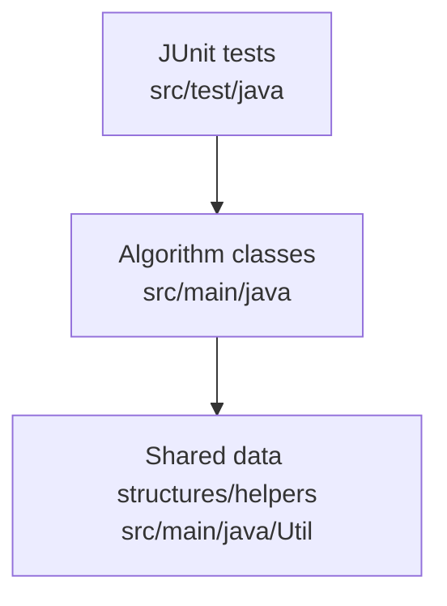

1. What this repository is
A Java-only Gradle project containing standalone algorithm and data-structure implementations plus JUnit 5 tests; it is not a service, CLI tool, UI app, or production library (evidence: `build.gradle`, `src/main/java`, `src/test/java`).

2. Why it exists
To provide a practice/reference set of interview-style solutions for Java developers and learners who want concrete examples with tests (evidence: the collection of problem-specific classes under `src/main/java` and tests under `src/test/java`).

3. Quickstart
- Prerequisites: Java 11 (per `.travis.yml`), Gradle (version Unknown; no wrapper present; install via package manager), internet access to download Maven Central dependencies (see `build.gradle`).
- Build: `gradle build`
- Test: `gradle test`
- Troubleshooting: if `gradle` is missing, install Gradle locally; if Java is not 11, align `JAVA_HOME` with a Java 11 installation; if dependency download fails, check network access to Maven Central (`build.gradle`).

4. Architecture at a glance

The tests instantiate algorithm classes, pass in-memory inputs, and assert results. Algorithms operate on primitives/collections or shared helper nodes in `src/main/java/Util` and return results; no external I/O or services are used (evidence: `src/main/java/**`, `src/test/java/**`).

5. Core components
- Algorithm packages: `src/main/java/Array`, `src/main/java/String`, `src/main/java/DP`, `src/main/java/Tree`, `src/main/java/Graph`, `src/main/java/BitManipulation`, `src/main/java/Sort`, `src/main/java/Math`, `src/main/java/Hashmap`, `src/main/java/Design`, `src/main/java/StackQueue`.
- Shared utilities: `src/main/java/Util` (common nodes and helpers such as `TreeNode`, `ListNode`, `TrieNode`, `Pair`, `Utils`).
- Tests: `src/test/java` (JUnit 5 tests per algorithm).
- Build config: `build.gradle`, `settings.gradle`.
- CI config: `.travis.yml`.

6. Interfaces
- Public Java methods exposed by each algorithm class (examples in tests such as `ThreeSum.threeSum` in `src/test/java/ThreeSumTest.java` and `Codec.serialize`/`deserialize` in `src/test/java/CodecTest.java`).
- Shared node/data structures used as inputs/outputs (`src/main/java/Util/TreeNode.java`, `src/main/java/Util/ListNode.java`, `src/main/java/Util/TrieNode.java`).
- No CLI commands, HTTP endpoints, message queues, or file-based interfaces are defined (evidence: `src/main/java/**`).

7. Configuration
- Environment variables: Unknown; they would be referenced in `src/main/java/**` or defined in `.env*` files (none found).
- Build configuration: `build.gradle` defines the Java plugin and JUnit dependencies; `settings.gradle` defines the project name.
- Runtime profiles: Unknown; a file like `application.yml`, `application.properties`, or `gradle.properties` would confirm (none present).
- Secrets: None declared or referenced in code/config (evidence: `src/main/java/**`, `build.gradle`, `.travis.yml`).

8. Dependencies and external services
- JUnit 5 (`org.junit.jupiter:junit-jupiter-api`, `org.junit.jupiter:junit-jupiter-engine`) via Maven Central (evidence: `build.gradle`).
- External services/databases/queues/cloud APIs: None referenced (evidence: `src/main/java/**`, `build.gradle`).

9. Quality and safety
- Tests: JUnit 5 tests under `src/test/java`; run with `gradle test` (evidence: `build.gradle`, `src/test/java`).
- CI: Travis CI configuration in `.travis.yml` (Java 11 on Linux).
- Linting/formatting: Unknown (no lint/format plugins in `build.gradle`).
- Static analysis/security scanning: Unknown (no scanners configured in `build.gradle`).
- Latest verification: `gradle test` failed locally because `gradle` is not installed (`zsh: command not found: gradle`).

10. Sensitive information review
Status: Clean
Reviewed areas: `src/main/java`, `src/test/java`, `build.gradle`, `settings.gradle`, `.travis.yml`, `.vscode/settings.json`, `.idea/gradle.xml`, `.idea/misc.xml`, `.idea/vcs.xml`, `README.md`, `LICENSE.md`, `LICENSE.txt`, `.gitignore`
Findings: none
Actions taken: none
Notes: No `.env` or key/cert files found in this repository.

11. What’s missing
- Documentation: P1/M — No per-class problem/complexity headers beyond a few inline notes; next action: add JavaDoc summaries to `src/main/java/**` explaining each problem and complexity.
- Tests: P1/M — Some algorithms may lack edge or performance cases; next action: add boundary/performance tests in `src/test/java`.
- Security: P2/S — No dependency or static analysis scanning; next action: add OWASP Dependency Check or similar to `build.gradle`.
- Reliability: P2/M — No stress/benchmark suite; next action: add benchmark-style tests for large inputs.
- Operations: P2/S — No packaging/publishing flow documented; next action: document JAR build/publish if needed.
- Developer experience: P1/S — No Gradle wrapper present; next action: add `gradlew` and document the supported Gradle version.

12. How this repository is useful
It provides a broad set of reusable Java algorithm implementations and test patterns that can seed new problem sets or serve as examples for interviews/teaching. The shared utility node types in `src/main/java/Util` can be reused safely in similar algorithm collections.

13. Automation hooks
Project type: Java algorithms library
Primary domain: Algorithm practice / data-structure exercises
Core entities: Problem-specific algorithm classes under `src/main/java/**`, shared utility nodes in `src/main/java/Util`
Extension points: Add new algorithm classes under the appropriate package in `src/main/java`; add tests under `src/test/java`
Areas safe to modify: New algorithm classes, new tests, dependencies in `build.gradle`
Areas requiring caution and why: `src/main/java/Util` types and helpers are shared across many algorithms/tests; changes can cascade broadly
Canonical commands: build `gradle build`; test `gradle test`; run (no global entrypoint; execute via tests or a custom harness)
