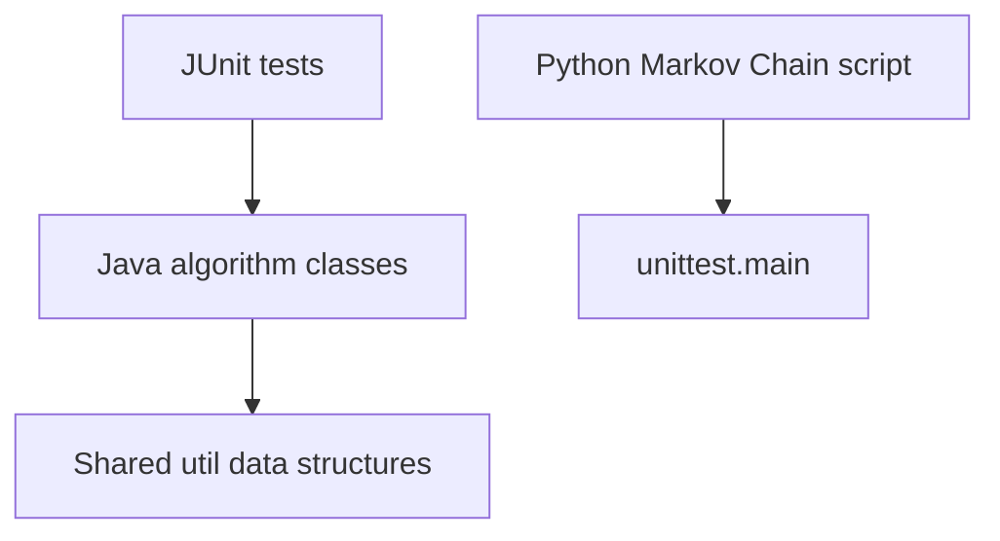

# 1. What this repository is
This is a Java Gradle project containing standalone algorithm/data-structure implementations with JUnit tests, plus a small Python algorithms folder; it is not a service, CLI tool, or production library. Evidence: `build.gradle`, `src/main/java`, `src/test/java`, `libs/algorithmsPython.git`.

# 2. Why it exists
It serves as a practice/reference set of algorithm solutions and tests for developers learning or reviewing common problems. Evidence: `src/main/java`, `src/test/java`.

# 3. Quickstart
Prerequisites:
- Java 11 (used in CI). Evidence: `.travis.yml`.
- Gradle (no wrapper included). Evidence: `.gitignore` lists `gradlew` and `gradle-wrapper.jar` as excluded, but no wrapper files are present.
- Python 3 with numpy for the Python script. Evidence: `libs/algorithmsPython.git/algorithms/Markov Chain/main.py`.

Run locally:
- Java build: `gradle build`. Evidence: `build.gradle`.
- Java tests: `gradle test`. Evidence: `build.gradle`, `src/test/java`.
- Python script: `python "libs/algorithmsPython.git/algorithms/Markov Chain/main.py"`. Evidence: `libs/algorithmsPython.git/algorithms/Markov Chain/main.py`.

Run tests:
- Java tests via Gradle: `gradle test`. Evidence: `build.gradle`.
- Python tests run via `unittest.main()` in the script above. Evidence: `libs/algorithmsPython.git/algorithms/Markov Chain/main.py`.

Troubleshooting:
- If `gradle` is not installed, install Gradle or add a wrapper. Evidence: `build.gradle`, `.gitignore`.
- If the Python script fails with missing `numpy`, install the dependency. Evidence: `libs/algorithmsPython.git/algorithms/Markov Chain/main.py`.

# 4. Architecture at a glance

Java tests exercise algorithm classes and shared utility nodes; a separate Python script contains a Markov Chain solution and runs unit tests when executed. Evidence: `src/main/java`, `src/test/java`, `libs/algorithmsPython.git/algorithms/Markov Chain/main.py`.

# 5. Core components
- Java algorithms by category: `src/main/java/Array`, `src/main/java/String`, `src/main/java/DP`, `src/main/java/Tree`, `src/main/java/Graph`, `src/main/java/BitManipulation`, `src/main/java/Sort`, `src/main/java/Math`, `src/main/java/Hashmap`, `src/main/java/Design`, `src/main/java/StackQueue`.
- Shared utilities (nodes/helpers): `src/main/java/Util`.
- Java tests: `src/test/java`.
- Python algorithms folder: `libs/algorithmsPython.git`.
- Build configuration: `build.gradle`, `settings.gradle`.
- CI configuration: `.travis.yml`.

# 6. Interfaces
- Java public methods in each algorithm class (called from tests). Evidence: `src/main/java/**`, `src/test/java/**`.
- Shared Java node types (`TreeNode`, `ListNode`, `TrieNode`, `Pair`) used as inputs/outputs. Evidence: `src/main/java/Util`.
- Python `solution(m)` function and `unittest.main()` execution. Evidence: `libs/algorithmsPython.git/algorithms/Markov Chain/main.py`.
- No HTTP endpoints, CLI app, or file-based interfaces beyond the Python script. Evidence: repository file listing.

# 7. Configuration
- Build config: `build.gradle` (JUnit dependencies, Java plugin), `settings.gradle` (project name).
- CI runtime: `.travis.yml` (OpenJDK 11 on Linux).
- Environment variables: Unknown; would be confirmed by references in source or `.env*` files (none found).
- Runtime profiles: Unknown; would be confirmed by `gradle.properties` or similar (none found).

Secrets and injection:
- No secrets referenced in code or config. Evidence: `src/main/java/**`, `build.gradle`, `.travis.yml`.

# 8. Dependencies and external services
- JUnit 5 via Maven Central. Evidence: `build.gradle`.
- Python dependency: `numpy`. Evidence: `libs/algorithmsPython.git/algorithms/Markov Chain/main.py`.
- External services/databases/queues/cloud APIs: None referenced. Evidence: `src/main/java/**`.

# 9. Quality and safety
- Tests: JUnit 5 tests under `src/test/java`; run `gradle test`. Evidence: `build.gradle`, `src/test/java`.
- CI: Travis CI configuration in `.travis.yml` (Java 11).
- Linting/formatting: None configured in `build.gradle`.
- Static analysis/security scanning: None configured in `build.gradle`.
- Verification: `gradle test` (failed locally: `gradle` not found).

# 10. Sensitive information review
Status: Clean

Reviewed areas:
- Java source: `src/main/java`.
- Java tests: `src/test/java`.
- Build/CI: `build.gradle`, `settings.gradle`, `.travis.yml`.
- Editor config: `.idea/gradle.xml`, `.idea/misc.xml`, `.idea/vcs.xml`, `.vscode/settings.json`.
- Documentation: `README.md`, `LICENSE.md`, `LICENSE.txt`.
- Python algorithms: `libs/algorithmsPython.git/README.md`, `libs/algorithmsPython.git/algorithms/Markov Chain/main.py`.
- Repo metadata: `.gitignore`.

Findings:
- None.

Actions taken:
- None.

Notes:
- `.DS_Store` is a binary file and was not inspected.

# 11. What’s missing
Documentation:
- P1 M: Problem statements and complexity notes are marked Unknown in many files. Next action: replace the placeholder headers in `src/main/java/**` with concrete summaries per algorithm.

Tests:
- P2 S: Some algorithms lack edge/performance tests. Next action: add boundary tests in `src/test/java`.

Security:
- P2 S: No dependency scanning. Next action: add a Gradle dependency scanning plugin.

Reliability:
- P2 M: No benchmarking harness. Next action: add a microbenchmark module or JMH tests.

Operations:
- P2 S: No Gradle wrapper. Next action: add `gradlew` and `gradle/wrapper/gradle-wrapper.properties`.

Developer experience:
- P2 S: No formatting/lint tooling. Next action: add Checkstyle/Spotless and document usage.

# 12. How this repository is useful
It provides reusable Java algorithm implementations and shared data-structure helpers for interview prep or teaching, plus a Python Markov Chain example. Evidence: `src/main/java/Util`, `libs/algorithmsPython.git/algorithms/Markov Chain/main.py`.

# 13. Automation hooks
Project type: Java algorithms library (Gradle) plus a standalone Python script.
Primary domain: Algorithm practice and data-structure exercises.
Core entities: Algorithm classes and shared utility nodes. Evidence: `src/main/java`, `src/main/java/Util`.
Extension points:
- Add new algorithms under `src/main/java/<Category>`.
- Add tests under `src/test/java`.
Areas safe to modify:
- New algorithm and test classes.
Areas requiring caution and why:
- `src/main/java/Util` types are shared across many algorithms/tests.
Canonical commands:
- Build: `gradle build`.
- Test: `gradle test`.
- Run: `python "libs/algorithmsPython.git/algorithms/Markov Chain/main.py"`.
