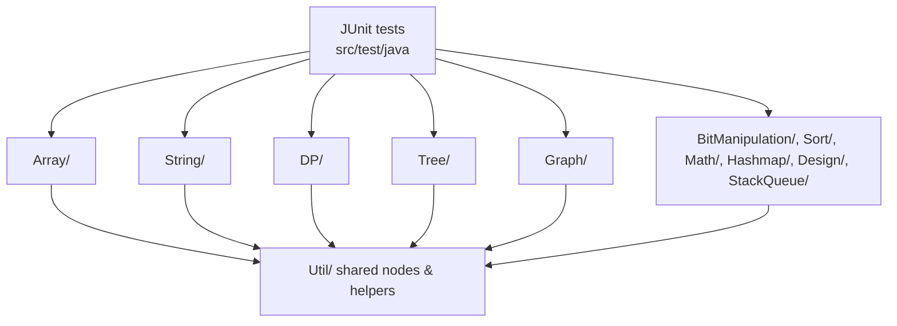

1. What this repository is
Java 11 Gradle project of standalone algorithm and data-structure implementations (arrays, strings, trees, graphs, DP, etc.) with accompanying JUnit 5 tests; no services, UIs, or external systems are present (see `build.gradle`, `src/main/java`, `src/test/java`).

2. Why it exists
Provides a practice and reference library for interview-style problems so developers can study patterns and run the solutions locally; intended for Java developers wanting ready-made examples with tests.

3. Quickstart
- Prerequisites: Java 11 (per `.travis.yml`), Gradle 6+ installed locally (no `gradlew` wrapper in repo), internet access to fetch Maven Central dependencies (see `build.gradle`).
- Install dependencies/build once: `gradle build`
- Run the full test suite: `gradle test`
- Troubleshooting: if Gradle is missing, install via your package manager; ensure JAVA_HOME points to Java 11; if dependency download fails, check network access to Maven Central.

4. Architecture at a glance

Control/data flow: JUnit tests under `src/test/java` instantiate algorithm classes in the domain folders, pass primitive/collection inputs, and assert results. Algorithms operate in-memory using shared data structures from `src/main/java/Util` (e.g., `TreeNode`, `ListNode`, `TrieNode`) and return values or mutate provided nodes; no external I/O beyond occasional console prints in utilities.

5. Core components
- Algorithm packages (`src/main/java/Array`, `String`, `DP`, `Tree`, `Graph`, `BitManipulation`, `Sort`, `Math`, `Hashmap`, `Design`, `StackQueue`): Individual classes implementing specific problems (e.g., `Array/ThreeSum.java`, `Tree/Codec.java`). Topic coverage includes arrays/lists, strings, dynamic programming, binary trees/BSTs, graphs, heaps/queues/stacks, bit manipulation, sorting/searching, math/number theory, hash maps/sets, and simple design exercises (paths verified by the package directories under `src/main/java`).
- Shared utilities (`src/main/java/Util`): Common data structures and helpers (`TreeNode`, `ListNode`, `TrieNode`, `Pair`, `MeanQueue`, `BitOperations`, `Utils`, `Player`).
- Tests (`src/test/java`): JUnit 5 test cases exercising algorithms (e.g., `src/test/java/ThreeSumTest.java`, `CodecTest.java`).
- Build config (`build.gradle`, `settings.gradle`): Java plugin, JUnit 5 dependencies, project name `Algorithms`.
- CI config (`.travis.yml`): Travis setup targeting OpenJDK 11 on Linux.

6. Interfaces
- Public Java APIs: Each algorithm class exposes one or more public methods (e.g., `ThreeSum.threeSum(int[])` in `src/main/java/Array/ThreeSum.java`, `Codec.serialize(TreeNode)`/`deserialize(String)` in `src/main/java/Tree/Codec.java`, `BinarySearch.search(int[], int)` in `src/main/java/Sort/BinarySearch.java`, `RecentCounter.ping(int)` in `src/main/java/StackQueue/RecentCounter.java`).
- Data structures: Shared node types (`Util.TreeNode`, `Util.ListNode`, `Util.TrieNode`, etc.) used as inputs/outputs across algorithms.
- No CLI commands, HTTP endpoints, message queues, or file-based inputs/outputs are defined (absence confirmed by lack of such code in `src/main/java/**`).
- Usage examples: JUnit tests demonstrate invocation patterns (e.g., constructing `ThreeSum` and calling `threeSum` in `src/test/java/ThreeSumTest.java`).

7. Configuration
- Environment variables: None referenced in source or build files (search across `src` and `build.gradle`).
- Build configuration: Dependencies and Java plugin in `build.gradle`; project name in `settings.gradle`.
- CI profile: `.travis.yml` specifies `language: java`, `jdk: openjdk11`, `os: linux`; no additional steps declared.
- Secrets: None referenced; no secret management mechanisms present.

8. Dependencies and external services
- JUnit 5.7 (`org.junit.jupiter:junit-jupiter-api`, `org.junit.jupiter:junit-jupiter-engine`) for tests — defined in `build.gradle`.
- External services/databases/queues/cloud APIs: None referenced in codebase (no such imports or configs in `src/main/java/**` or `build.gradle`).

9. Quality and safety
- Tests: JUnit 5 suite in `src/test/java`; run with `gradle test`.
- Latest verification: `gradle test` failed locally because `gradle` is not installed in the environment (`command not found`); install Gradle and rerun.
- CI: Travis CI configured via `.travis.yml` (defaults to Gradle build lifecycle with Java 11).
- Linting/formatting: Not configured (no Checkstyle/Spotless/PMD rules in `build.gradle`).
- Static analysis/security scanning: None configured (no dependency check or static analysis plugins).
- Test/Build status: Not yet run in this update (run `gradle test` to verify locally).

10. What’s missing
- Documentation: P1/M — Per-class problem statements and usage notes are minimal; next action: add JavaDoc summaries to algorithms in `src/main/java/**`.
- Tests: P1/M — Edge cases and performance scenarios may be uncovered; next action: extend `src/test/java` with boundary cases (empty inputs, large inputs).
- Security: P2/S — No static analysis or dependency scanning; next action: add a security scan plugin (e.g., OWASP Dependency Check) to `build.gradle`.
- Reliability: P2/M — No stress/performance tests; next action: add benchmark-style tests for heavy input sizes.
- Operations: P2/S — No packaging or artifact publication steps; next action: document or script JAR publishing if needed.
- Developer experience: P1/S — No Gradle wrapper and limited onboarding notes; next action: generate `gradlew` and document tool versions.

11. How this repository is useful
Reusable, dependency-light Java implementations of common algorithms and data structures useful for interview prep, teaching, or seeding solutions in other projects. Shared utilities (`Util/*`) and test patterns can be safely reused in new algorithm collections or coding exercise setups.

12. Automation hooks
- Project type: Library (algorithms and utilities).
- Primary domain: Algorithm practice/interview prep.
- Core entities: Algorithm classes per domain (Array, String, DP, Tree, Graph, etc.) and shared nodes/helpers (`TreeNode`, `ListNode`, `TrieNode`, `MeanQueue`, `BitOperations`, `Utils`).
- Extension points: Add new problem classes under an existing domain folder in `src/main/java/**`; add shared helpers in `src/main/java/Util`; add tests in `src/test/java`.
- Areas safe to modify: New classes in domain folders, new tests, dependency updates in `build.gradle`.
- Areas requiring caution: Changes to `Util/*` types or method signatures can cascade across many algorithms/tests; adjust dependents accordingly.
- Canonical commands: build `gradle build`; test `gradle test`; run (no runtime entrypoint — invoke specific classes via tests or a custom harness).
